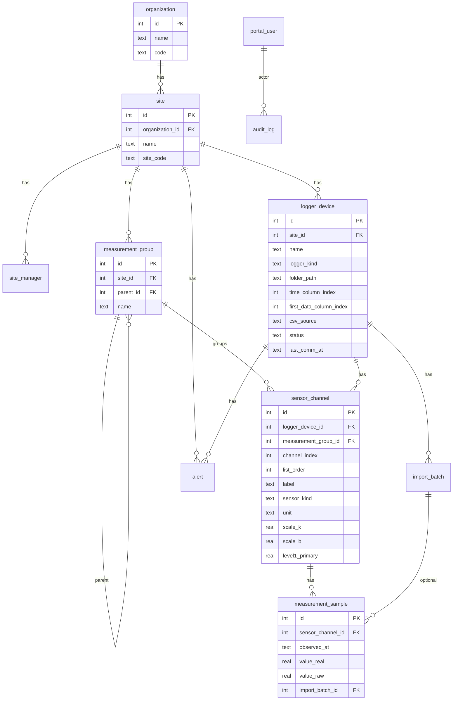

# 계측관리 웹 — 화면 맵 · 엔티티 관계 (1단계 설계)

관련: [데이터 모델(2단계)](./DATA_MODEL_PHASE2.md)

**전제**: 본 시스템(코드 루트: `measurement_portal/SurveyMgmtPortal`)은 **Convert Pro(`Convert_pro3.py`)와 프로세스·DB·코드 공유 없이 완전 분리**.  
데이터는 **웹 전용 DB**에 두고, CSV 등은 **업로드·경로 지정·운영 절차**로 웹 쪽에 반영.

---

## 1. 엔티티 관계 (현재 스키마 기준)

**용어 매핑 (레거시 데스크톱 UI와)**  

| 레거시 | 웹 DB |
|--------|--------|
| 현장명 / 현장코드 | `site.name`, `site.site_code` |
| 로거명, 파일경로, 로거종류, 로거번호, CSV 열 설정 | `logger_device` (`time_column_index`, `first_data_column_index`, `csv_source`) |
| 센서 열 번호, 표시명, 단위, 관리기준, 카테고리 | `sensor_channel` + `measurement_group` |
| 수집된 시계열 | `measurement_sample` (+ 선택 `import_batch`) |

---

## 2. 화면 맵 (URL 초안)

| 상태 | 경로 | 설명 |
|------|------|------|
| 기존 | `/login` | 로그인 |
| 기존 | `/dashboard` | 요약 카드·이슈 로거·알림 (현장 진입 전 허브) |
| 계획 | `/sites` | 업체별 현장 목록, 현장 생성·편집 |
| 계획 | `/sites/<id>` | 현장 상세: 담당자, 하위 메뉴(로거·설정) |
| 계획 | `/sites/<id>/loggers` | 로거 그리드: **파일 경로 셀**(더블클릭 → 파일 선택/경로 저장), 사용 여부, 종류, 로거번호 |
| 계획 | `/loggers/<id>/sensors` | 센서 목록·추가: **열 인덱스**, 라벨, 종류, `scale_k`/`scale_b`, 관리기준 |
| 계획 | `/channels/<id>/chart` | 참고 UI: 기간 조회, 그래프+표, (후속) 엑셀·구간 삭제 |
| 후순위 | `/reports/...` | 보고서 생성·목록 |
| 후순위 | `/account` | 계정·비밀번호 (다 사용자 시 `portal_user` 연동) |

**글로벌 내비 (참고 스크린 상단·좌측)**  

- 뒤로 / 현장 리스트 / 계정  
- 좌측: 현장명·갱신 시각, 보고서·수동입력·현장설정·센서설정·**카테고리(트리)**  
- 트리 노드 클릭 → 우측 `.../chart` 로 동일 레이아웃 유지

---

## 3. 데이터 들어오는 통로 (웹만의 규칙)

1. 사용자가 로거에 **파일 경로** 저장 (`logger_device.folder_path`). (브라우저 보안상 로컬 경로는 **서버가 접근 가능한 경로**이거나, 추후 **파일 업로드**로 대체.)
2. 센서에 **열 인덱스**·스케일 저장.
3. **적재**: CLI `scripts/measurement_ingest.py` 또는 추후 **웹 “수집 실행”** 버튼 → `measurement_sample` 채움.
4. **그래프**: `GET /api/measurements/series` 등으로 조회.

Convert Pro와 **자동 동기화 없음** — 같은 CSV를 사람이 웹 규칙에 맞게 넣는 것만 전제.

---

## 4. MVP 사용자 여정 (한 줄)

**현장 생성 → 로거 추가 → 경로 지정 → 센서·열·스케일 저장 → CSV 적재 → 채널 그래프에서 기간 조회**

보고서·SMS·복잡 카테고리 트리는 이 줄이 끊기지 않은 뒤 확장.

---

## 5. 2단계 확정 (필드·정책)

상세 표와 적재 연동은 **[DATA_MODEL_PHASE2.md](./DATA_MODEL_PHASE2.md)** 참고.

- **시간·값 열**: 로거별 `time_column_index`, `first_data_column_index` (기본 0 / 1).
- **카테고리**: `measurement_group` + `sensor_channel.measurement_group_id`.
- **경로 vs 업로드**: `csv_source`(`server_path` \| `upload`); 업로드 저장·UI는 후속.

이 문서는 구현이 진행되면 라우트·필드가 바뀔 때마다 짧게 갱신하면 됩니다.
